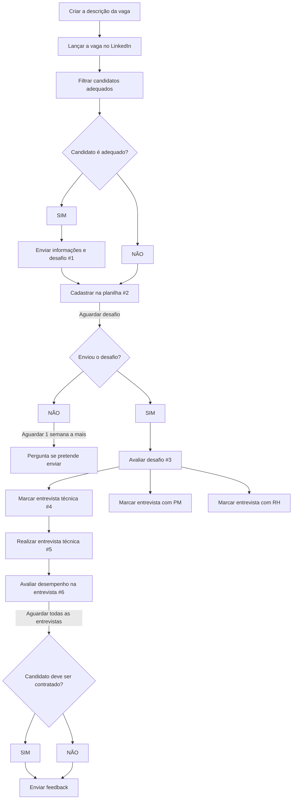

```mermaid
graph TD
A[Criar a descrição da vaga] --> B[Lançar a vaga no LinkedIn]
B --> C[Filtrar candidatos adequados]
C --> D{Candidato é adequado? }
D --> E[SIM]
D --> F[NÃO]
E --> G[Enviar informações e desafio #1]
G --> H[Cadastrar na planilha #2]
F --> H
H -- Aguardar desafio --> I{Enviou o desafio?}
I --> J[SIM]
I --> K[NÃO]
K -- Aguardar 1 semana a mais --> O[Pergunta se pretende enviar]
J --> L[Avaliar desafio #3]
L --> M[Marcar entrevista técnica #4]
L --> P[Marcar entrevista com PM]
L --> Q[Marcar entrevista com RH]
M --> N[Realizar entrevista técnica #5]
N --> R[Avaliar desempenho na entrevista #6]
R -- Aguardar todas as entrevistas -->  S{Candidato deve ser contratado?}
S --> T[SIM]
S --> U[NÃO]
T --> V[Enviar feedback]
U --> V

```
